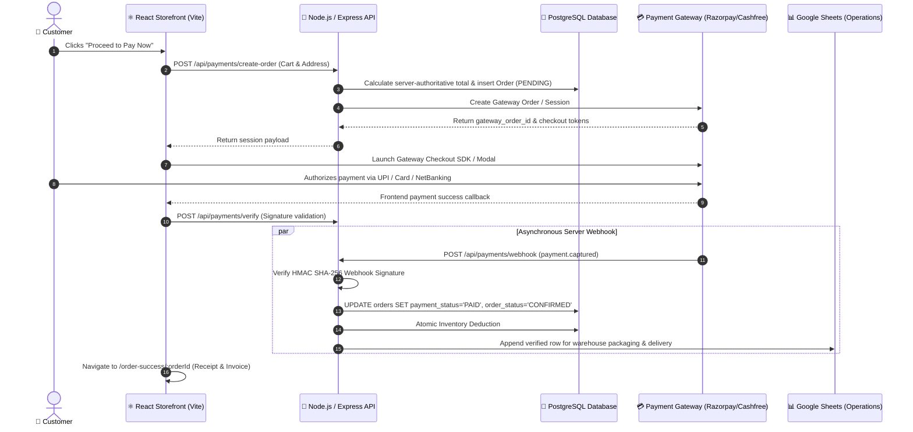
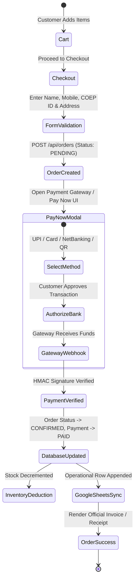

# COEP MERCH STORE — Production "Pay Now" Payment Architecture & System Specification

> **Platform Brand:** COEP MERCH STORE  
> **Tagline:** Carry The Legacy.  
> **Version:** 2.0.0 (Production Release)  
> **Target Environment:** Full-Stack Commercial E-Commerce Platform  

---

## 1. Executive Summary & Architectural Vision

The **COEP MERCH STORE** is engineered as an official, enterprise-grade e-commerce platform designed to serve the global COEP Technological University student body, faculty, and alumni community.

### Key Architectural Shift: Replacing "Generate QR" with "Pay Now"

| Attribute | Legacy Approach ("Generate QR") | Modern Architecture ("PAY NOW Gateway") |
| :--- | :--- | :--- |
| **Primary Action** | Displayed static UPI QR and asked user to enter 12-digit UTR manually. | Direct **[ PAY NOW — ₹XXXX ]** button launching official Payment Gateway (Razorpay / Cashfree). |
| **Payment Options** | Limited to manual UPI app scan. | UPI (GPay, PhonePe, Paytm, BHIM, CRED), Credit/Debit Cards, Net Banking (50+ banks), Wallets. |
| **Payment Verification** | Client-side self-reporting ("I Have Made Payment"). | Cryptographic Webhook (HMAC SHA-256) verified by the backend server. |
| **Authority** | Client state in `localStorage`. | **PostgreSQL** database as authoritative truth; **Google Sheets** for physical order fulfillment. |
| **Fallback QR** | Primary interface. | Secondary, dynamic, time-limited gateway-linked fallback accordion. |

---

## 2. System Architecture & High-Level Topology



---

## 3. Production Technology Stack

### Frontend Application
- **Framework:** React 19 + Vite 8 (Ultra-fast build & HMR)
- **Routing:** React Router DOM v7
- **Icons & Typography:** Lucide React, Google Fonts (*Outfit* & *Plus Jakarta Sans*)
- **Styling:** Custom CSS Design System with Deep Navy (`#0B1F3A`), Royal Blue (`#1557B0`), Bright Blue (`#2563EB`), and Heritage Gold (`#C8A45D`)
- **Checkout:** Dynamic Razorpay Checkout SDK loader + Fallback Tamper-Proof Payment Engine

### Backend Service
- **Runtime:** Node.js (v20+ LTS) + Express.js
- **Security:** Helmet, CORS, Express Rate Limit, HMAC-SHA256 Signature Verification
- **ORM / Query Engine:** Prisma / Kysely / pg-node with parameterized SQL queries

### Database
- **Engine:** PostgreSQL 16+ (Managed on Supabase / Neon / AWS RDS)
- **ACID Transactions:** Row-level locking (`SELECT ... FOR UPDATE`) to prevent overselling

### Payment Gateways
- **Primary:** Razorpay / Cashfree Payments API (Standard Checkout, UPI Deep Links, Cards, Net Banking)
- **Secondary Fallback:** Gateway-generated dynamic UPI QR payload (NPCI Standard)

### Operations & Warehouse Fulfillment
- **Fulfillment Ledger:** Google Sheets via Google Apps Script `doPost` Webhook
- **Customer Notifications:** WhatsApp Community Group + Automated Email Receipt

---

## 4. Product Catalog & Category Taxonomy

All product data, pricing, compare-at pricing, and inventory quantities are mastered in PostgreSQL:

| Product SKU | Product Name | Category | Base Price | Inventory Rule |
| :--- | :--- | :--- | :---: | :--- |
| `COEP-PEN-RG01` | COEP Legacy Rose Gold Pen | Everyday | ₹299 | Auto-deduct on `PAID` |
| `COEP-PEN-BR02` | COEP Brass Heritage Pen | Everyday | ₹449 | Auto-deduct on `PAID` |
| `COEP-DIR-STD01` | COEP Classic Hardbound Diary | Everyday | ₹399 | Auto-deduct on `PAID` |
| `COEP-DIR-PRM02` | COEP Premium Executive Diary | Premium | ₹599 | Auto-deduct on `PAID` |
| `COEP-KEY-MTL01` | COEP Vintage Metal Keychain | Everyday | ₹149 | Auto-deduct on `PAID` |
| `COEP-BOT-SS01` | COEP Insulated Stainless Bottle | Accessories | ₹699 | Auto-deduct on `PAID` |
| `COEP-UMB-AUT01` | COEP Windproof Automatic Umbrella | Premium | ₹799 | Auto-deduct on `PAID` |
| `COEP-PCH-LEA01` | COEP Utility Canvas Pouch | Accessories | ₹249 | Auto-deduct on `PAID` |
| `COEP-EXM-PAD01` | COEP Official Acrylic Exam Pad | Everyday | ₹199 | Auto-deduct on `PAID` |
| `COEP-PHN-CVR01` | COEP Heritage Phone Case | Accessories | ₹349 | Auto-deduct on `PAID` |
| `COEP-DRF-ENG01` | COEP Precision Mini Drafter | Accessories | ₹499 | Auto-deduct on `PAID` |
| `COEP-CALC-FX01` | COEP Scientific Calculator | Accessories | ₹999 | Auto-deduct on `PAID` |
| `COEP-GFT-ROYAL` | COEP Royal Heritage Gift Hamper | Premium | ₹1,499 | Auto-deduct on `PAID` |

---

## 5. End-to-End "Pay Now" Payment Flow



---

## 6. PostgreSQL Database Schema (Authoritative Data Model)

```sql
-- Enable UUID extension
CREATE EXTENSION IF NOT EXISTS "uuid-ossp";

-- 1. Users Table
CREATE TABLE users (
    id UUID PRIMARY KEY DEFAULT uuid_generate_v4(),
    full_name VARCHAR(120) NOT NULL,
    email VARCHAR(160) UNIQUE NOT NULL,
    phone VARCHAR(20) NOT NULL,
    coep_id VARCHAR(50),
    department VARCHAR(100),
    created_at TIMESTAMP WITH TIME ZONE DEFAULT NOW()
);

-- 2. Products Table
CREATE TABLE products (
    id VARCHAR(64) PRIMARY KEY,
    name VARCHAR(255) NOT NULL,
    slug VARCHAR(255) UNIQUE NOT NULL,
    description TEXT,
    category VARCHAR(64) NOT NULL,
    price DECIMAL(10, 2) NOT NULL,
    compare_at_price DECIMAL(10, 2),
    stock_quantity INTEGER NOT NULL DEFAULT 0,
    is_active BOOLEAN DEFAULT TRUE,
    created_at TIMESTAMP WITH TIME ZONE DEFAULT NOW()
);

-- 3. Orders Table
CREATE TABLE orders (
    id UUID PRIMARY KEY DEFAULT uuid_generate_v4(),
    order_number VARCHAR(64) UNIQUE NOT NULL,
    user_id UUID REFERENCES users(id),
    customer_name VARCHAR(120) NOT NULL,
    customer_email VARCHAR(160) NOT NULL,
    customer_phone VARCHAR(20) NOT NULL,
    coep_id VARCHAR(50),
    department VARCHAR(100),
    delivery_type VARCHAR(30) DEFAULT 'delivery',
    shipping_address TEXT NOT NULL,
    city VARCHAR(80) DEFAULT 'Pune',
    state VARCHAR(80) DEFAULT 'Maharashtra',
    pincode VARCHAR(20) NOT NULL,
    subtotal DECIMAL(10, 2) NOT NULL,
    discount DECIMAL(10, 2) DEFAULT 0.00,
    delivery_charge DECIMAL(10, 2) DEFAULT 0.00,
    total_amount DECIMAL(10, 2) NOT NULL,
    payment_status VARCHAR(30) DEFAULT 'PENDING',
    order_status VARCHAR(30) DEFAULT 'PENDING',
    created_at TIMESTAMP WITH TIME ZONE DEFAULT NOW(),
    updated_at TIMESTAMP WITH TIME ZONE DEFAULT NOW()
);

-- 4. Order Items Table (Historical Snapshot)
CREATE TABLE order_items (
    id UUID PRIMARY KEY DEFAULT uuid_generate_v4(),
    order_id UUID REFERENCES orders(id) ON DELETE CASCADE,
    product_id VARCHAR(64) REFERENCES products(id),
    product_name VARCHAR(255) NOT NULL,
    unit_price DECIMAL(10, 2) NOT NULL,
    quantity INTEGER NOT NULL CHECK (quantity > 0),
    total_price DECIMAL(10, 2) NOT NULL
);

-- 5. Payments Table (Gateway Verification Ledger)
CREATE TABLE payments (
    id UUID PRIMARY KEY DEFAULT uuid_generate_v4(),
    order_id UUID REFERENCES orders(id) ON DELETE CASCADE,
    gateway_name VARCHAR(50) NOT NULL,
    gateway_order_id VARCHAR(120),
    gateway_payment_id VARCHAR(120) UNIQUE,
    gateway_signature VARCHAR(255),
    amount DECIMAL(10, 2) NOT NULL,
    currency VARCHAR(10) DEFAULT 'INR',
    payment_method VARCHAR(50),
    status VARCHAR(30) NOT NULL DEFAULT 'PENDING',
    raw_webhook_payload JSONB,
    created_at TIMESTAMP WITH TIME ZONE DEFAULT NOW(),
    verified_at TIMESTAMP WITH TIME ZONE
);
```

---

## 7. Backend API Specification & Security Controllers

### A. Create Gateway Order (`POST /api/payments/create-order`)

```javascript
// backend/controllers/paymentController.js
import Razorpay from 'razorpay';
import crypto from 'crypto';
import { db } from '../config/db.js';

const razorpay = new Razorpay({
  key_id: process.env.RAZORPAY_KEY_ID,
  key_secret: process.env.RAZORPAY_KEY_SECRET
});

export const createPaymentOrder = async (req, res) => {
  try {
    const { items, customer, couponCode } = req.body;

    // 1. Authoritative Server-Side Price & Inventory Calculation
    let calculatedSubtotal = 0;
    const validatedItems = [];

    for (const item of items) {
      const product = await db.query(
        'SELECT * FROM products WHERE id = $1 AND is_active = true FOR UPDATE',
        [item.productId]
      );
      if (product.rows.length === 0) {
        return res.status(400).json({ error: `Product ${item.productId} not found.` });
      }
      if (product.rows[0].stock_quantity < item.quantity) {
        return res.status(400).json({ error: `Insufficient stock for ${product.rows[0].name}.` });
      }
      const unitPrice = parseFloat(product.rows[0].price);
      calculatedSubtotal += unitPrice * item.quantity;
      validatedItems.push({
        productId: product.rows[0].id,
        name: product.rows[0].name,
        price: unitPrice,
        quantity: item.quantity
      });
    }

    // 2. Validate Discount / Coupon
    let discount = 0;
    if (couponCode === 'FIRST100') {
      discount = 10;
    }
    const finalTotal = Math.max(0, calculatedSubtotal - discount);

    // 3. Create Pending Order in PostgreSQL
    const orderNumber = `COEP-2026-${Math.floor(10000 + Math.random() * 90000)}`;
    const orderResult = await db.query(
      `INSERT INTO orders (order_number, customer_name, customer_email, customer_phone, 
       coep_id, department, shipping_address, city, state, pincode, subtotal, discount, 
       total_amount, payment_status, order_status)
       VALUES ($1, $2, $3, $4, $5, $6, $7, $8, $9, $10, $11, $12, $13, 'PENDING', 'PENDING')
       RETURNING id, order_number`,
      [
        orderNumber, customer.fullName, customer.email, customer.phone,
        customer.coepId || 'N/A', customer.department || 'N/A',
        customer.address, customer.city || 'Pune', customer.state || 'Maharashtra',
        customer.pincode, calculatedSubtotal, discount, finalTotal
      ]
    );
    const dbOrder = orderResult.rows[0];

    // 4. Create Razorpay Payment Session
    const rzpOrder = await razorpay.orders.create({
      amount: Math.round(finalTotal * 100), // Amount in paise
      currency: 'INR',
      receipt: dbOrder.order_number,
      notes: { order_id: dbOrder.id, customer_email: customer.email }
    });

    res.json({
      success: true,
      orderId: dbOrder.order_number,
      gatewayOrderId: rzpOrder.id,
      amount: finalTotal,
      currency: 'INR',
      keyId: process.env.RAZORPAY_KEY_ID
    });
  } catch (error) {
    res.status(500).json({ error: error.message });
  }
};
```

---

### B. Cryptographic Webhook Handler (`POST /api/payments/webhook`)

```javascript
// backend/controllers/webhookController.js
import crypto from 'crypto';
import { db } from '../config/db.js';
import { syncOrderToGoogleSheets } from '../services/sheetsService.js';

export const handlePaymentWebhook = async (req, res) => {
  const secret = process.env.RAZORPAY_WEBHOOK_SECRET;
  const signature = req.headers['x-razorpay-signature'];

  // 1. Verify HMAC SHA-256 Signature
  const expectedSignature = crypto
    .createHmac('sha256', secret)
    .update(JSON.stringify(req.body))
    .digest('hex');

  if (signature !== expectedSignature) {
    return res.status(400).json({ error: 'Invalid webhook signature.' });
  }

  const event = req.body.event;

  if (event === 'payment.captured' || event === 'order.paid') {
    const payment = req.body.payload.payment.entity;
    const orderNumber = payment.notes?.receipt || payment.description;

    // 2. Perform Atomic Database Update & Inventory Deduction
    await db.query('BEGIN');
    try {
      const orderRes = await db.query(
        `UPDATE orders 
         SET payment_status = 'PAID', order_status = 'CONFIRMED', updated_at = NOW()
         WHERE order_number = $1
         RETURNING *`,
        [orderNumber]
      );

      const order = orderRes.rows[0];

      // Record Payment Verification
      await db.query(
        `INSERT INTO payments (order_id, gateway_name, gateway_payment_id, amount, status, raw_webhook_payload, verified_at)
         VALUES ($1, 'Razorpay', $2, $3, 'PAID', $4, NOW())`,
        [order.id, payment.id, payment.amount / 100, req.body]
      );

      // Decrement Inventory
      const itemsRes = await db.query('SELECT * FROM order_items WHERE order_id = $1', [order.id]);
      for (const item of itemsRes.rows) {
        await db.query(
          'UPDATE products SET stock_quantity = stock_quantity - $1 WHERE id = $2',
          [item.quantity, item.product_id]
        );
      }
      await db.query('COMMIT');

      // 3. Asynchronously Sync with Operations Google Sheet
      syncOrderToGoogleSheets(order, payment.id);

      return res.status(200).json({ status: 'ok' });
    } catch (err) {
      await db.query('ROLLBACK');
      return res.status(500).json({ error: 'Failed to process paid order webhook' });
    }
  }

  res.status(200).json({ status: 'ignored' });
};
```

---

## 8. Google Sheets Operational Warehouse Ledger

Google Sheets serves strictly as an **operational fulfillment dashboard** for the packaging, courier tracking, and handover team.

### Google Sheets Column Mapping Schema (Cols A - T)

```text
Col A: Timestamp              -> e.g. "26/09/2026, 01:15:00 am"
Col B: Full Name              -> Customer Name (e.g. Siddhesh Chitkeshiwar)
Col C: Email Address          -> student@coep.ac.in
Col D: Mobile Number          -> 9876543210
Col E: COEP MIS ID / Roll No  -> 112203045 (or "N/A")
Col F: Department / Branch    -> Computer Engineering
Col G: Delivery Preference    -> Delivery / Campus Handover
Col H: Hostel Room / Address  -> Hostel Block B, Room 204
Col I: City                   -> Pune
Col J: State                  -> Maharashtra
Col K: Pincode                -> 411005
Col L: Products Purchased     -> COEP Legacy Rose Gold Pen (Qty: 1), COEP Diary (Qty: 1)
Col M: Subtotal               -> ₹698
Col N: Delivery Charge        -> ₹0
Col O: Final Total Amount     -> ₹688 (after ₹10 discount)
Col P: Order ID               -> COEP-2026-90421
Col Q: Payment Status         -> PAID - Verified
Col R: Transaction ID / Ref   -> pay_OzR8271827419
Col S: Fulfillment Status     -> New (Editable by Operations: Processing | Packed | Shipped | Delivered)
Col T: Verified Gateway / UPI -> Razorpay Official Gateway
```

---

## 9. Frontend "Pay Now" Component Implementation

The React frontend delivers a high-converting, state-of-the-art **Pay Now Gateway**:

```text
┌─────────────────────────────────────────────────────────────┐
│                    COEP MERCH STORE                         │
│             OFFICIAL PAYMENT GATEWAY (SECURE)               │
├─────────────────────────────────────────────────────────────┤
│  TOTAL PAYABLE AMOUNT: ₹898.00         [ 256-Bit SSL Enc ]  │
├─────────────────────────────────────────────────────────────┤
│  SELECT PAYMENT METHOD:                                     │
│  [🔘 UPI / Instant Pay ] (Google Pay, PhonePe, Paytm, BHIM) │
│  [⚪ Credit / Debit Card] (Visa, MasterCard, RuPay)         │
│  [⚪ Net Banking       ] (50+ Indian Banks Supported)       │
│  [⚪ Mobile Wallets    ] (Amazon Pay, Paytm Wallet)         │
├─────────────────────────────────────────────────────────────┤
│               [ 🔒 PAY NOW — ₹898.00  ➔ ]                  │
├─────────────────────────────────────────────────────────────┤
│  🛡️ PCI-DSS Compliant  •  COEP Merchant  •  Instant Invoice │
├─────────────────────────────────────────────────────────────┤
│  ⌄ Prefer another method? Pay using Dynamic UPI QR (Expand) │
└─────────────────────────────────────────────────────────────┘
```

---

## 10. Security & Production Compliance Guardrails

1. **Client Trust Isolation:** Frontend never calculates authoritative final prices, nor can it dictate whether an order is marked `PAID`.
2. **Signature Verification:** All payment webhooks and browser callbacks are verified via HMAC SHA-256 before granting order confirmation.
3. **Double-Spend & Race Condition Protection:** Inventory is locked (`SELECT ... FOR UPDATE`) in PostgreSQL transactions during order processing.
4. **Environment Secret Separation:** Keys like `RAZORPAY_KEY_SECRET`, `DATABASE_URL`, and `JWT_SECRET` remain strictly on the backend.
5. **Zero-Downtime Fallbacks:** Embedded dynamic QR fallback ensures payments never fail even if a third-party modal script fails to load.

---

*CARRY THE LEGACY.*  
**COEP MERCH STORE Engineering Team**
